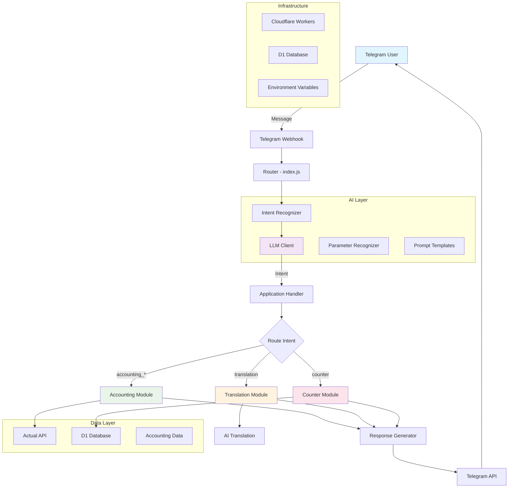

# Telegram AI Assistant

A personal Telegram bot powered by AI that provides various utility applications including accounting, translation, and counter functionalities. Built on Cloudflare Workers for serverless deployment.

> **⚠️ Personal Project Notice**: This is a personal project tailored to specific needs and configurations. It is **not designed for reuse** and serves as a reference implementation only. The codebase contains hardcoded values, personal API configurations, and specific business logic that may not be applicable to other use cases.

## Project Overview

This Telegram AI Assistant leverages Large Language Models (LLM) for intent recognition and parameter extraction, enabling natural language interactions with various application modules. The bot processes user messages, identifies intents, and routes requests to appropriate application handlers.

## Architecture & Design



### Core Components

- **Intent Recognition**: AI-powered natural language understanding
- **Application Router**: Routes recognized intents to appropriate modules
- **LLM Integration**: Supports multiple AI providers with configurable models
- **Modular Architecture**: Extensible application modules
- **Serverless Deployment**: Built for Cloudflare Workers

## Supported Application Modules

### 🧮 Accounting Module
Personal finance management with transaction recording, budget tracking, and integration with Actual Budget API for comprehensive financial oversight.

### 🌐 Translation Module
AI-powered multi-language translation service supporting automatic language detection and translation between major languages including Chinese, English, Japanese, Korean, and European languages.

### 📊 Counter Module
Habit tracking and goal management system with persistent storage, allowing users to track daily activities, set goals, and monitor progress over time.

## Technology Stack

- **Runtime**: Cloudflare Workers
- **Router**: itty-router
- **AI Integration**: OpenAI API (configurable)
- **Database**: Cloudflare D1 (SQLite)
- **External APIs**: Actual Budget API
- **Deployment**: Wrangler CLI

## Development Setup

```bash
# Install dependencies
npm install

# Development server
npm run dev

# Deploy to Cloudflare Workers
npm run deploy
```

## Configuration

The project requires several environment variables:

- `TELEGRAM_BOT_TOKEN`: Telegram Bot API token
- `OPENAI_API_KEY`: OpenAI API key for LLM services
- Additional API keys for specific modules (Actual Budget, etc.)

## Project Structure

```
src/
├── ai/                 # AI and LLM integration
│   ├── intentRecognizer.js
│   ├── parameterRecognizer.js
│   └── llmClient.js
├── applications/       # Application modules
│   ├── accounting.js
│   ├── translation.js
│   └── counter.js
├── services/          # External service integrations
│   └── telegram.js
└── index.js           # Main application entry point
```

## License

This project is licensed under the MIT License - see the [LICENSE](LICENSE) file for details.

---

**Disclaimer**: This is a personal project developed for specific use cases and requirements. While the code is open source, it is not intended for direct reuse without significant modifications. Use as reference material only.
